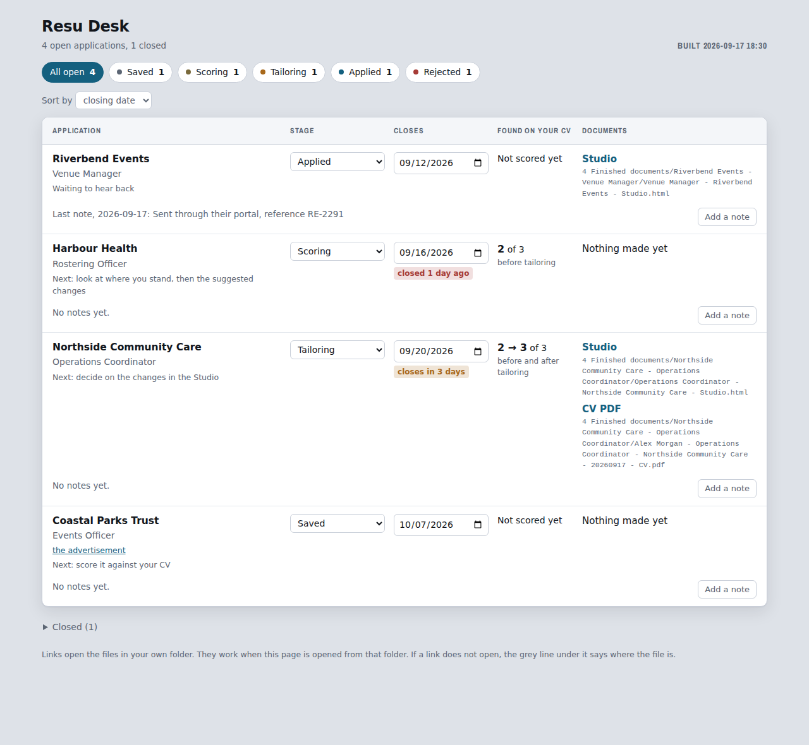
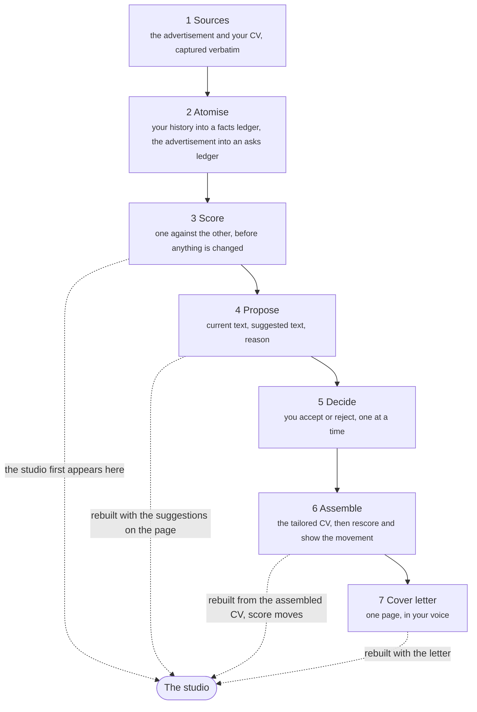

# Resu Studio

Build a tailored CV, resume and cover letter for every job.


It reads the advertisement and your CV, scores one against the other, and shows you
where you stand before it changes a word. Every proposed change arrives as three
things, the current text, the suggested text, and the reason, and you accept or
reject them one at a time. Then it rescores, so you can see what your decisions
actually moved.

The finished CV and cover letter print to PDF exactly as the studio shows them: the
same colours, the same layout, the same skills graphics, the same typefaces, and the
text stays text so an applicant tracking system can still read it.

## It tells you where you stand before it changes anything


Two numbers, and the gap between them is the whole point. **What you have** counts
everything in your record that answers the advertisement, however it happens to be
worded. **What a reader would find** counts only what a person going through your CV
would actually see. When those two disagree, the problem is wording rather than
experience, and that is a problem you can fix without inventing anything.

Every criterion is listed worst first, with the advertisement's own words, the line on
your CV that answers it, and one of seven plain states. `buried` means the work is
there and their term for it is not. `near` means half of it is answered and nothing
claims the rest. `missing` means nothing in your record touches it, and it says so
without softening.

## What comes out


The PDF is printed, not redrawn. The same stylesheet, the same palette, the same
paginator deciding the page breaks, put through a real browser. What you approved on
screen is what lands in the file, down to where each page ends.

The text stays text, so a screening system can still read it. Before it hands anything
over it reads the finished PDF back and checks the typefaces are the ones you chose. If
a face was substituted it deletes the file and says which one, rather than giving you a
document that looks finished and has quietly re-flowed every line.

Your name, the role, the employer and the date go into the filename, and every job
keeps its documents in a folder of its own, so two applications cannot overwrite each other.

<br clear="all">

## Every application in one place



Apply for as many jobs as you like at once. Each job ad gets its own folder, its own
Studio and its own documents, and nothing from one ever turns up in another. Your CV and
your history are shared, so the second ad does not ask for your CV again.

**Resu Desk** is one page listing every application: the stage it is at, when it closes,
how the score moved, and a link to each Studio and PDF. Closing dates in the next week are
flagged. Change a stage, a date or add a note right on the page, then hand it back to the
AI, which writes it into your records. If a job changed in the meantime, it asks you which
is right instead of writing over it. The Desk rebuilds itself whenever anything changes.

## The seven phases

Each one stops and waits for you. Finishing one is not permission to begin the next.



The facts ledger is built once and reused. A second advertisement reads it rather
than asking you for your CV again.

The studio is rebuilt and handed back every time something on the page changes, so you
never have to ask to see where things stand.

## What it will not do

- It will not invent experience, inflate a level, or turn a duty into an achievement
  you did not describe. Every line traces back to something you wrote.
- It will not quietly hand you a document that differs from what you approved. If a
  typeface cannot be loaded, it deletes the PDF and says which one, rather than
  substituting a face with different metrics and re-flowing every line.
- It will not write over an earlier application. Every job ad is its own job, with its
  own folder. Re-rendering the same document replaces it, which is what you want when
  trying skins.
- It will not decide where your private files live, or use older work it finds on your
  computer, without asking you first.

## Installing it

Resu Studio is one skill, written to the open [Agent Skills](https://agentskills.io)
standard, so the same repository installs into Claude and into other AI tools. Every
install reads this repository, so an update here reaches all of them.

**Claude (Cowork).** Open Customize, then Plugins, then Add marketplace, and enter:

```
CX-Instruments/resu-studio
```

Resu Studio then appears in your plugin browser to install. To install a downloaded
file instead, use the upload option on the same page and pick the `.plugin` file from
[Releases](https://github.com/CX-Instruments/resu-studio/releases).

**ChatGPT and Codex.** Open Plugins, choose to add a plugin marketplace, and enter
`CX-Instruments/resu-studio` as the source, with `main` as the Git ref and nothing under
sparse paths. Resu Studio then appears in the list to install. Where ChatGPT can run
the scripts, everything works; where it cannot, the scoring, suggestions and letter
still do, and the studio and PDF do not.

**Claude Code, Codex, GitHub Copilot, Cursor, Gemini CLI and other agents.** Install it
with the [Skills CLI](https://github.com/vercel-labs/skills), which needs Node.js:

```
npx skills add CX-Instruments/resu-studio
```

It asks which of your AI tools to install it into. To pick one yourself, add
`-a codex`, `-a cursor`, `-a github-copilot`, `-a gemini-cli` or `-a claude-code`. To
pick up a later version:

```
npx skills update
```

The Skills CLI counts installs anonymously, which is how skills are ranked on
[skills.sh](https://skills.sh). That count is the CLI's, not Resu Studio's. Set
`DISABLE_TELEMETRY=1` before running it to turn it off.

## Getting started

Say what you are applying for and give it your CV. It will ask for the job pack if
the advertisement points at one, and it will ask how deep to score before it starts,
because that is the longest part of the job and the decision is yours.

## Where your files go

Your CV, your history, your job ads and your finished documents are private, and where
they live is your choice. The first time Resu Studio runs, it asks. It suggests a folder
called `Resu - CV Builder`, either inside the project you installed it into or in your
home folder, and you can name any other. If it finds work from an earlier version
anywhere on your computer, it tells you where and asks whether to bring it in. It never
uses it without asking.

```
Resu - CV Builder/
  1 About me/            your CV as you gave it, and any links you shared
  2 My record/           everything learned about your working life, reused for every job
  3 Jobs/                one folder for each job ad
  4 Finished documents/  Resu Desk, and a folder of finished documents for each job
```

The folder holds its own `.gitignore`, so if it sits inside a git repository, git ignores
all of it and nothing private can be committed by accident. A `README.txt` in the folder
says the same in plain words. The folder is outside the plugin, so an update cannot delete
it, and the choice is remembered for each place the plugin is installed.

## What you need to install

**In Claude's Cowork: nothing.** You will not be asked to run a command, set a path, or
install anything. The work happens in Claude's own session, and the finished documents
come back to you as files. You should never have to know what any of it is written in.

**In an AI tool that runs on your own computer** (Claude Code, Codex, Copilot, Cursor,
Gemini CLI), the work happens on your machine, so it needs two things most computers
already have:

- **Python 3.8 or newer.** The scripts use only what comes with Python, so there is
  nothing else to install alongside it. Anaconda and Miniconda count: the skill carries a
  small finder that looks in their folders, the `py` launcher and python.org installs, so
  you should never have to tell the AI where your Python is.
- **Chrome, Edge or Chromium**, to print the PDF. Without one, everything else still
  works, and the studio prints the PDF from your own browser with **Save as PDF**.

**In a chat that cannot run code**, the scoring, the suggested changes and the cover
letter still work. The studio and the PDF need somewhere to run.

The typefaces are carried inside the plugin, so your documents print the same whether
or not the machine doing the printing has ever been online. The studio you look at on
screen carries the same ones, so the page breaks you see are the page breaks you get.

## What the scripts do

Skills that ship scripts deserve a look before they run on your computer. These are
all in [`skills/resu-studio/scripts`](skills/resu-studio/scripts), use only Python's
standard library, and do three things beyond reading and writing files:

- **They write only to your own folder**, `.resu-studio` in your home folder or the
  one you chose. Nothing is sent anywhere.
- **`to_pdf.py` and `render_cv.py` start your browser** in headless mode, with no
  window, to print the finished page to PDF and to measure page breaks. Starting a
  browser is the only other program they run.
- **`fetch_fonts.py` downloads typefaces from Google Fonts**, and only when you run it.
  The fonts are already in the repository, so it is for adding a new one. A page set
  in a face that is not carried falls back to linking Google Fonts, and the PDF check
  refuses a document whose face did not arrive.

## Support

Questions, bugs and requests go to
[Issues](https://github.com/CX-Instruments/resu-studio/issues). That is the
support channel and it is read. Please include the version, which is printed at
the top left of any studio page you have open.

## Privacy

Resu Studio collects nothing. No account, no server, no analytics. Your CV and
your finished documents stay in your own folder. See [PRIVACY.md](PRIVACY.md).
The terms of use are in [TERMS.md](TERMS.md).

## Licence

Resu Studio is free software under the GNU Affero General Public License, version 3
or later. You can read it, run it, change it and pass it on. If you run a changed
version as a service that other people use over a network, you have to make your
changes available to them under the same licence.

The full text is in [LICENSE](LICENSE).

---

The screenshots on this page were made from a fictional CV that ships nowhere near
your files. Nothing personal to anyone appears in this repository.
