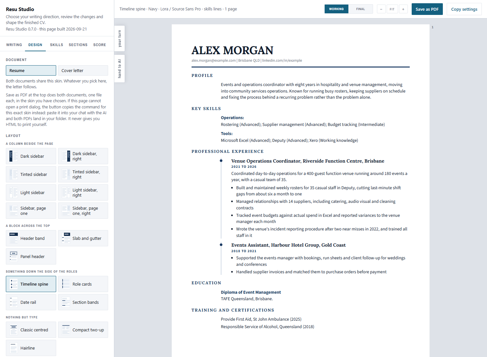
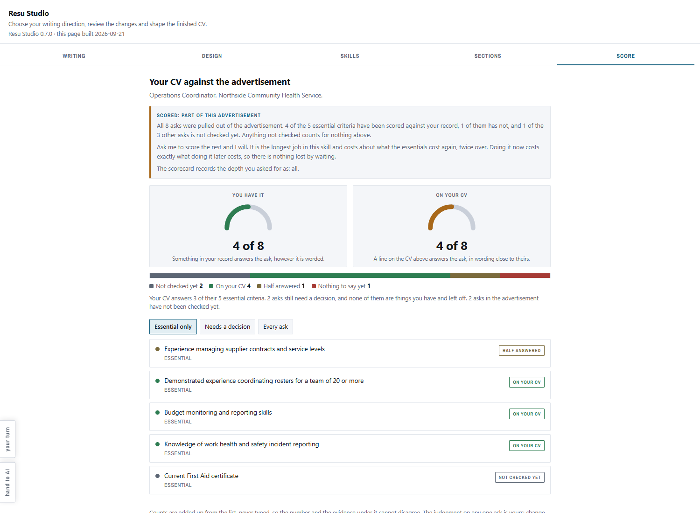
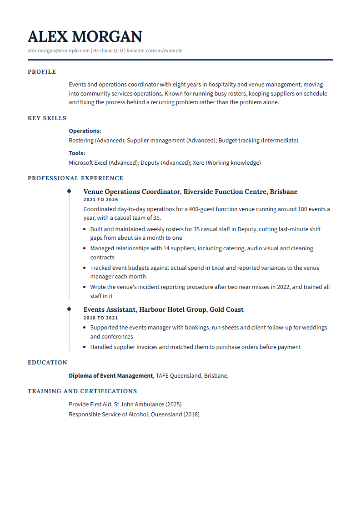

# Resu Studio

Tailor a CV and a written application to one job advertisement, honestly.



It reads the advertisement and your CV, scores one against the other, and shows you
where you stand before it changes a word. Every proposed change arrives as three
things, the current text, the suggested text, and the reason, and you accept or
reject them one at a time. Then it rescores, so you can see what your decisions
actually moved.

The finished CV and cover letter print to PDF exactly as the studio shows them: the
same colours, the same layout, the same skills graphics, the same typefaces, and the
text stays text so an applicant tracking system can still read it.

## It tells you where you stand before it changes anything



Two numbers, and the gap between them is the whole point. **What you have** counts
everything in your record that answers the advertisement, however it happens to be
worded. **What a reader would find** counts only what a person going through your CV
would actually see. When those two disagree, the problem is wording rather than
experience, and that is a problem you can fix without inventing anything.

Every criterion is listed worst first, with the advertisement's own words, the line on
your CV that answers it, and one of seven plain states. `buried` means the work is
there and their term for it is not. `near` means half of it is answered and nothing
claims the rest. `missing` means nothing in your record touches it, and it says so
without softening.

## What comes out



The PDF is printed, not redrawn. The same stylesheet, the same palette, the same
paginator deciding the page breaks, put through a real browser. What you approved on
screen is what lands in the file, down to where each page ends.

The text stays text, so a screening system can still read it. Before it hands anything
over it reads the finished PDF back and checks the typefaces are the ones you chose. If
a face was substituted it deletes the file and says which one, rather than giving you a
document that looks finished and has quietly re-flowed every line.

Your name, the role, the employer and the date go into the filename, so two
applications for the same job title at different employers cannot overwrite each other.

<br clear="all">

## The seven phases

Each one stops and waits for you. Finishing one is not permission to begin the next.


The facts ledger is built once and reused. A second advertisement reads it rather
than asking you for your CV again.

The studio is rebuilt and handed back every time something on the page changes, so you
never have to ask to see where things stand.

## What it will not do

- It will not invent experience, inflate a level, or turn a duty into an achievement
  you did not describe. Every line traces back to something you wrote.
- It will not quietly hand you a document that differs from what you approved. If a
  typeface cannot be loaded, it deletes the PDF and says which one, rather than
  substituting a face with different metrics and re-flowing every line.
- It will not write over an earlier application. Re-rendering the same document
  replaces it, which is what you want when trying skins. A different advertisement
  keeps the earlier file under a dated name, and the employer is in the filename, so
  two applications for the same job title at different employers stay apart.

## Installing it

In Cowork, open Customize, then Plugins, then Add marketplace, and enter:

```
CX-Instruments/resu-studio
```

Resu Studio then appears in your plugin browser to install. To install a downloaded
file instead, use the upload option on the same page and pick the `.plugin` file from
[Releases](https://github.com/CX-Instruments/resu-studio/releases).

## Getting started

Say what you are applying for and give it your CV. It will ask for the job pack if
the advertisement points at one, and it will ask how deep to score before it starts,
because that is the longest part of the job and the decision is yours.

## Where your files go

Your history and your finished documents do **not** live inside the plugin. They live
in `.resu-studio` in your home folder, so a plugin update cannot delete them. That is
the default and it needs no setting up.

```
python3 scripts/paths.py       where your folder is, and why
python3 scripts/documents.py   what you have produced, and for which advertisement
```

To choose the folder yourself, put a single line, the path you want, in
`.resu-studio/location` in your home folder. The older `data-location.txt` beside
`SKILL.md` still works, and the first time it is used it is copied out to
`.resu-studio/location`, so the next update cannot take the pointer with it.

Write the path the way the machine doing the work sees it. It starts with a `/` and
has no drive letter and no backslashes. A Windows path like `D:\Users\you\CVs` is
refused with a message saying so, and where it can, the message names the folder on
the working machine that looks like the one you meant.

If you used this before it stopped keeping files inside the plugin, your old folder is
copied out to the new one the first time it runs. Nothing is moved, nothing already in
the new folder is written over, and it tells you what it did. It happens once.

Your CV, your facts ledger and every PDF you have already produced survive every new
advertisement. Only the job-specific work is replaced, and you are told before it is.

## What you need to install

Nothing.

You will not be asked to run a command, set a path, or install anything. The work
happens where Claude is running, and the finished documents come back to you as files.
You should never have to know what any of it is written in.

The typefaces are carried inside the plugin, so your documents print the same whether
or not the machine doing the printing has ever been online. The studio you look at on
screen carries the same ones, so the page breaks you see are the page breaks you get.

## Support

Questions, bugs and requests go to
[Issues](https://github.com/CX-Instruments/resu-studio/issues). That is the
support channel and it is read. Please include the version, which is printed at
the top left of any studio page you have open.

## Privacy

Resu Studio collects nothing. No account, no server, no analytics. Your CV and
your finished documents stay in your own folder. See [PRIVACY.md](PRIVACY.md).

## Licence

Resu Studio is free software under the GNU Affero General Public License, version 3
or later. You can read it, run it, change it and pass it on. If you run a changed
version as a service that other people use over a network, you have to make your
changes available to them under the same licence.

The full text is in [LICENSE](LICENSE).

---

The screenshots on this page were made from a fictional CV that ships nowhere near
your files. Nothing personal to anyone appears in this repository.
